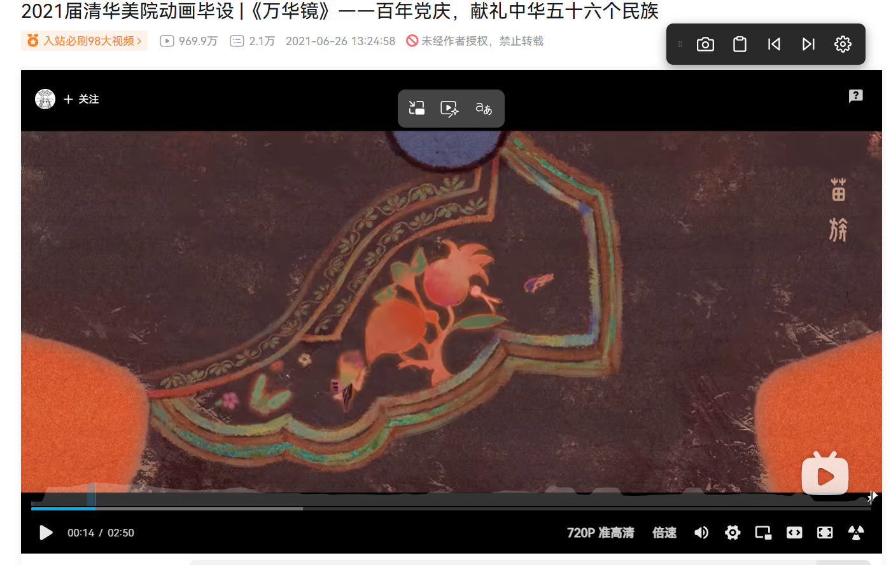

# BiViShot｜B站视频帧截图

[](https://github.com/hyglgithub/BiViShot/releases)
[](https://github.com/hyglgithub/BiViShot/releases)
[](LICENSE)

在 B 站视频页截取当前视频帧，直接从原始视频帧提取图像，几乎无损保存，画面清晰。

## 功能

- 📷 **视频截图到文件** — 保存当前视频帧为 PNG/JPEG 图片
- 📋 **视频截图到剪贴板** — 复制当前视频帧到系统剪贴板（始终使用 PNG 格式）
- ⏮ **上一帧** — 视频暂停时逐帧后退（支持长按连续移动）
- ⏭ **下一帧** — 视频暂停时逐帧前进（支持长按连续移动）
- ⚙️ **设置** — 配置截图格式、质量、帧步长

### 设置选项

| 选项 | 说明 |
|------|------|
| 截图格式 | PNG（无损）或 JPEG（有损） |
| JPEG 质量 | 1-100%，仅 JPEG 格式有效 |
| 帧步长 | 1/1、1/5、1/15、1/30 秒 |

## 功能演示



## 安装方式

### Chrome / Edge

1. 在 GitHub 的 [Releases](https://github.com/hyglgithub/BiViShot/releases) 页面下载最新的 `bivishot-v*-chrome.zip` 包
2. 解压到任意本地目录
3. 打开扩展管理页：
   - Chrome：`chrome://extensions/`
   - Edge：`edge://extensions/`
4. 开启"开发者模式"
5. 点击"加载已解压的扩展程序"
6. 选择解压后的扩展目录（包含 `manifest.json` 的目录）

### 从源码安装

```bash
git clone https://github.com/hyglgithub/BiViShot.git
```

然后按照上述步骤 3-6 加载扩展。

## 使用方法

1. 打开 B 站视频页（支持视频页、播放列表页、番剧页）
2. 视频区域附近会出现悬浮工具条
3. 点击工具条上的按钮进行操作

### 工具条功能

| 按钮 | 功能 | 说明 |
|------|------|------|
| ⋮⋮ | 拖动手柄 | 按住拖动工具条位置 |
| 📷 | 保存截图 | 下载当前视频帧为图片文件 |
| 📋 | 复制到剪贴板 | 将当前视频帧复制到剪贴板 |
| ⏮ | 上一帧 | 视频暂停时可用，支持长按 |
| ⏭ | 下一帧 | 视频暂停时可用，支持长按 |
| ⚙️ | 设置 | 打开/关闭设置面板 |

### 帧导航

- **点击**：移动一帧
- **长按**：持续移动（500ms 后开始自动重复）

### 拖动工具条

- 按住左侧拖动手柄（六个点图标）拖动
- 松开后位置自动保存
- 工具条和设置面板会一起移动

## 技术原理

直接从 `<video>` 元素提取原始帧数据，使用 `OffscreenCanvas` 绘制后转换为图片。由于不经过编码压缩，截图质量接近无损。

## 文件大小参考

| 分辨率 | PNG 大小 | JPEG 大小 (95%) |
|--------|----------|-----------------|
| 4K     | ~7MB     | ~1.5MB          |
| 1080p  | ~2.1MB   | ~500KB          |
| 720p   | ~700KB   | ~200KB          |

## 项目结构

```
BiViShot/
├── manifest.json      # 扩展配置 (Manifest V3)
├── js/
│   ├── storage.js     # Chrome Storage API 封装
│   ├── capture.js     # OffscreenCanvas 截图逻辑
│   ├── frame-nav.js   # 帧导航
│   ├── toolbar.js     # 工具条 UI 和设置面板
│   └── content.js     # 入口脚本
├── css/
│   └── toolbar.css    # 工具条样式
├── icons/             # 扩展图标
└── popup/             # 扩展弹窗设置
```

## 兼容性

- Chrome 88+ (Manifest V3)
- Edge 88+ (Manifest V3)

## 许可证

[MIT](LICENSE)

## 免责声明

> ▎ **用户自负责任条款**：本工具仅在用户已登录 B 站、且有访问权限的前提下获取数据。所有数据通过用户自己的浏览器获取，不经过任何第三方服务器。本工具不存储、不分发任何 B 站内容。使用本工具产生的所有后果由用户自行承担。请遵守 B 站用户协议与相关法律法规。
